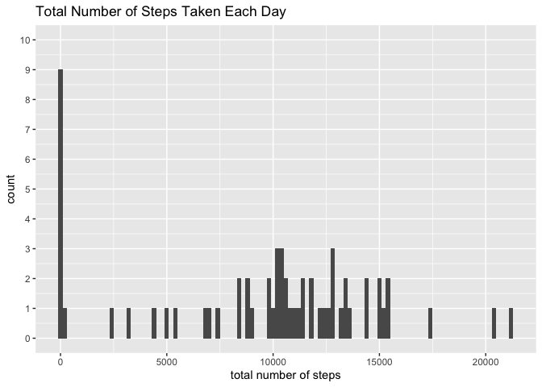
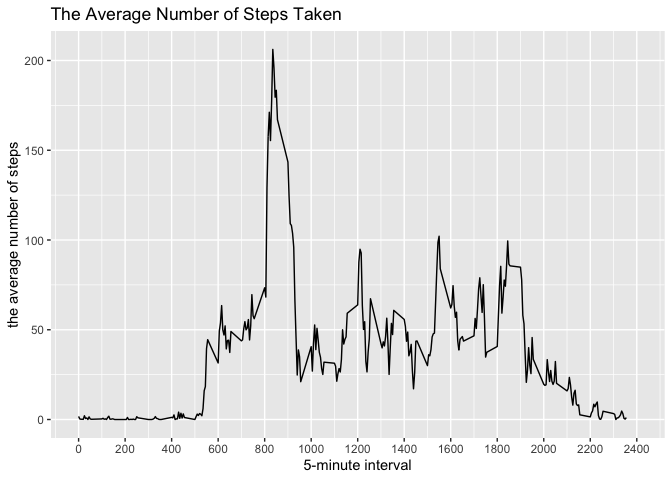
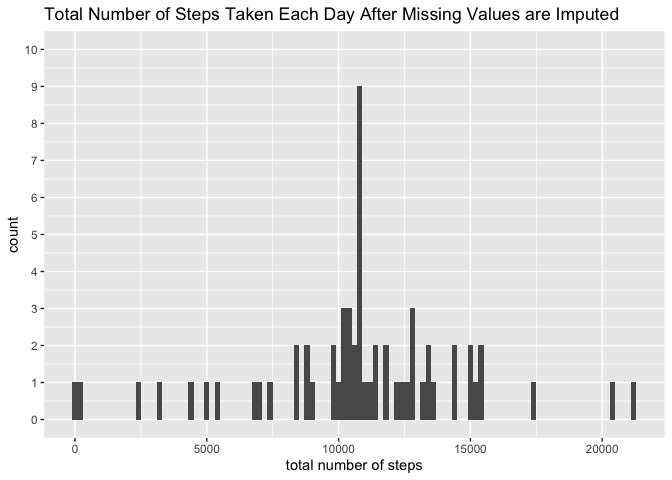
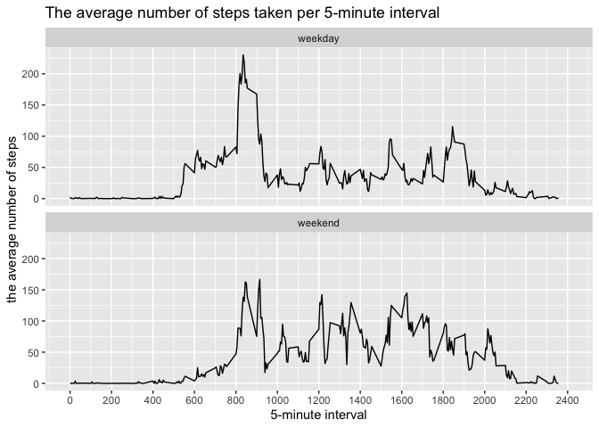

## Loading and preprocessing the data

```r
knitr::opts_chunk$set(echo = TRUE)
library(dplyr)
```

```
## 
##  次のパッケージを付け加えます: 'dplyr'
```

```
##  以下のオブジェクトは 'package:stats' からマスクされています: 
## 
##      filter, lag
```

```
##  以下のオブジェクトは 'package:base' からマスクされています: 
## 
##      intersect, setdiff, setequal, union
```

```r
library(ggplot2)
data <- read.csv(unzip("activity.zip"), header=T)
```

## What is mean total number of steps taken per day?

```r
### calculating the total number of steps taken per day
df <- group_by(data, date) %>% summarize(totalsteps = sum(steps, na.rm=TRUE))

### plotting the histogram
p <- ggplot(df, aes(x=totalsteps)) + geom_histogram(binwidth=200) +
        scale_y_continuous(breaks=seq(0,10),limits=c(0,10))　+
        xlab("total number of steps") +
        labs(title="Total Number of Steps Taken Each Day")
print(p)
```

<!-- -->

```r
ggsave("./figure/plot1.png", p)
```

```
## Saving 7 x 5 in image
```

```r
### reporting the mean and median of the total number of steps taken per day
df %>% summarize(mean = mean(totalsteps), median = median(totalsteps))
```

```
## # A tibble: 1 × 2
##    mean median
##   <dbl>  <int>
## 1 9354.  10395
```

## What is the average daily activity pattern?

```r
### calculating the average number of steps per interval
df <- group_by(data, interval) %>% summarize(avsteps = mean(steps, na.rm=TRUE))

### plotting the average daily active pattern's graph
p <- ggplot(df, aes(x=interval, y=avsteps)) + geom_line() +
        scale_x_continuous(breaks=seq(0,2400,200),limits=c(0,2400))　+
        xlab("5-minute interval") +  ylab("the average number of steps") +
        labs(title="The Average Number of Steps Taken")
print(p)
```

<!-- -->

```r
ggsave("./figure/plot2.png", p)
```

```
## Saving 7 x 5 in image
```

```r
### reporting the interval which contains the maximum number of steps
df %>% summarize(average = mean(avsteps), maximum = max(avsteps))
```

```
## # A tibble: 1 × 2
##   average maximum
##     <dbl>   <dbl>
## 1    37.4    206.
```

## Imputing missing values

```r
### reporting the total number of the missing values in the dataset 
data %>% summarize(total_number = sum(is.na(data$steps)))
```

```
##   total_number
## 1         2304
```

```r
### filling in all of the missing values with the mean for that 5-minute interval
nadata <- data[is.na(data$steps),]
nadata$steps <- df[match(c(nadata$interval), c(df$interval)),]$avsteps
newdata <- rbind(nadata, data[!is.na(data$steps),])

### calculating the total number of steps taken per day
ndf <- group_by(newdata, date) %>% summarize(totalsteps = sum(steps, na.rm=TRUE))

### plotting the histogram
p <- ggplot(ndf, aes(x=totalsteps)) + geom_histogram(binwidth=200) +
        scale_y_continuous(breaks=seq(0,10),limits=c(0,10))　+
        xlab("total number of steps") +
        labs(title="Total Number of Steps Taken Each Day After Missing Values are Imputed")
print(p)
```

<!-- -->

```r
ggsave("./figure/plot3.png", p)
```

```
## Saving 7 x 5 in image
```

```r
### reporting the mean and median total number of steps taken per day.
ndf %>% summarize(mean = mean(totalsteps), median = median(totalsteps))
```

```
## # A tibble: 1 × 2
##     mean median
##    <dbl>  <dbl>
## 1 10766. 10766.
```

## Are there differences in activity patterns between weekdays and weekends?

```r
### createing the new factor variable in the dataset with "weekday" and "weekend"
levels <- weekdays(as.Date(newdata$date))
levels[levels %in% c("月曜日", "火曜日", "水曜日", "木曜日", "金曜日")]<-"weekday"
levels[levels %in% c("土曜日", "日曜日")]<-"weekend"
levels <- factor(levels)
newdata <- cbind(newdata, levels)

### plotting the panels
ndf <- group_by(newdata, interval, levels) %>% summarize(avsteps = mean(steps, na.rm=TRUE))
```

```
## `summarise()` has grouped output by 'interval'. You can override using the
## `.groups` argument.
```

```r
p <- ggplot(ndf, aes(x=interval, y=avsteps)) + 
        geom_line(na.rm=TRUE) + facet_wrap(~levels, nrow=2) +
        scale_x_continuous(breaks=seq(0,2400,200),limits=c(0,2400))　+
        xlab("5-minute interval") + ylab("the average number of steps") +
        labs(title="The average number of steps taken per 5-minute interval")
print(p)
```

<!-- -->

```r
ggsave("./figure/plot4.png",p)
```

```
## Saving 7 x 5 in image
```
